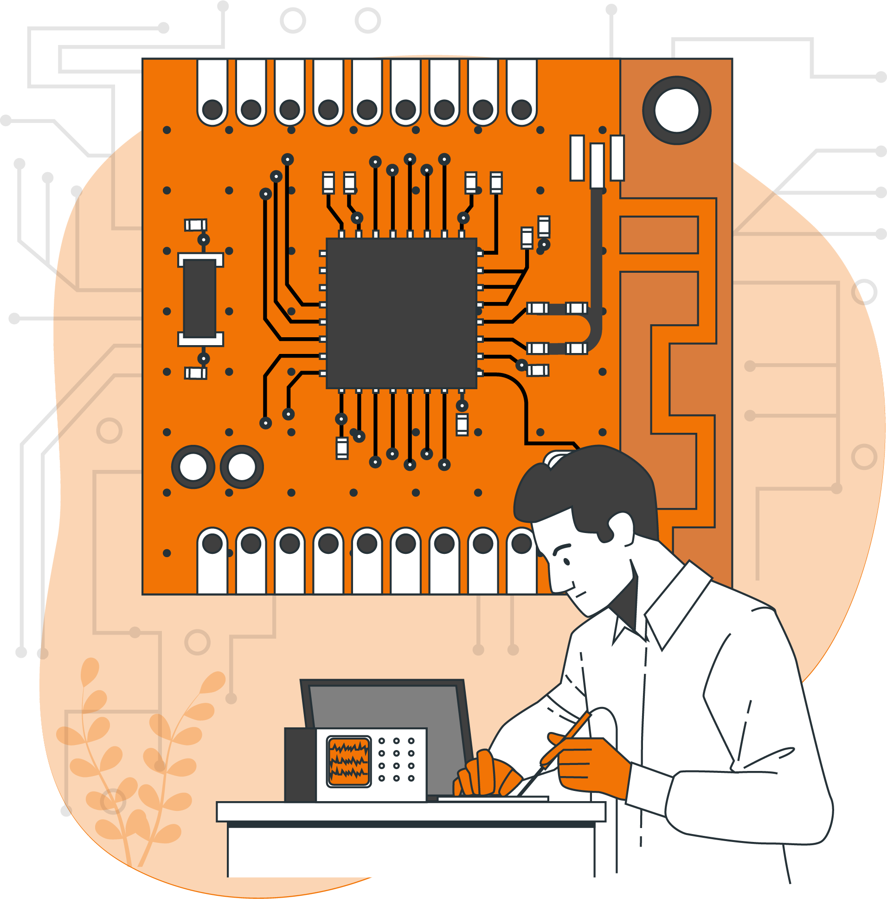

### Schematic / Multi-Layer PCB Design

A printed circuit board (PCB) allows manufacturers to create complex wiring and circuitry on an organized and relatively small piece of flat material.
We Model and Print PCBs for your requirements and needs at EMD-LABS

### IoT Based Platform & Application

An IoT platform enables IoT device and endpoint management, connectivity and network management, data management, processing and analysis, application development, security, access control, monitoring, event processing and interfacing/integration
