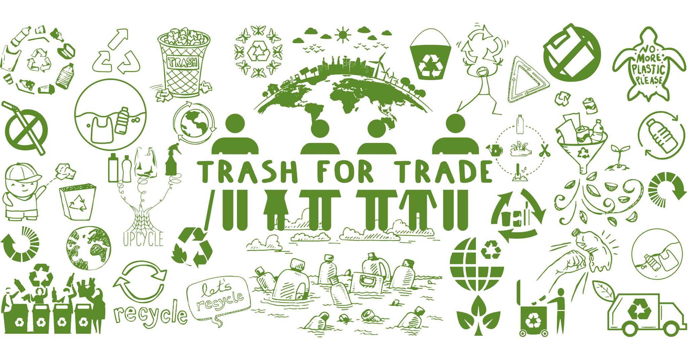
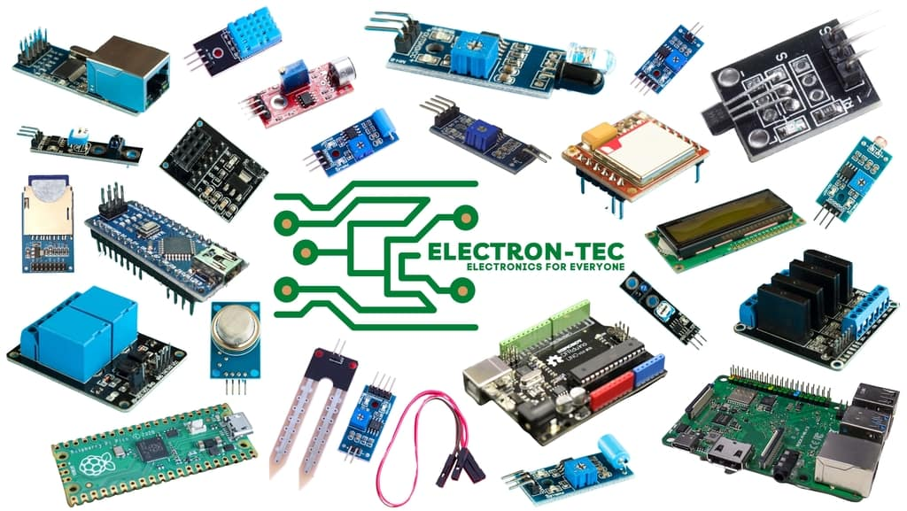

### Trash For Trade

Trash for Trade is a Plastic Upcycling Social Enterprise.It is a social innovation idea developed from an open-source community, ‘Precious Plastic’ with the support of DreamSpace Academy. We have taken upon this initiative using the upcycling machinery our team has built.
Trash for Trade community provides innovative, economic, efficient, reliable, eco-friendly upcycling technology to Sri Lanka along with spreading awareness about its environmental and economic benefits.

### Guess-Me

Guess Me is a new gift shop in town and shop still you drop. Are you planning on surprising your loved ones on their special day!!! We are here to serve you on special occasions with a unique variety of customized gifts for your special person. We help you to make them even more special.

### Electron-tech

Electron-tech is a electronics start-up focusing on providing electronics items for an affordable price for students. We also make the electronic goods available for our region. We mainly target the students who are intrested in doing electronics projects.
We sell electronics boards and equipments all other electronic related components. We value our customers and delivering them as soon as possible. Our prices are reasonable. We also provide various Electronics related services for you.

### BR Consultancy
