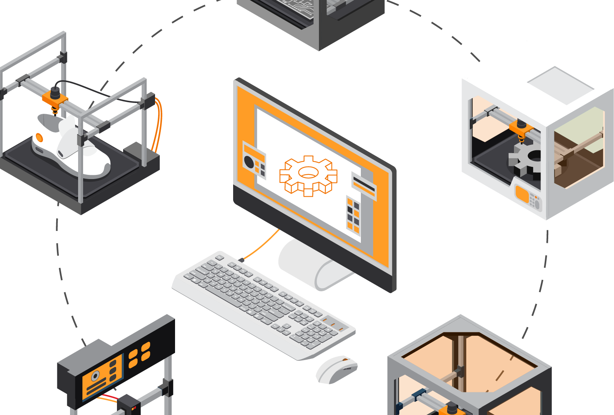

### 3D Modelling & Designing

3D printing or additive manufacturing is a process of making three dimensional solid objects from a digital file. The creation of a 3D printed object is achieved using additive processes. In an additive process an object is created by laying down successive layers of material until the object is created.
We Model and Print your orders at EMDLABS.

### Smart Infrastructure Design

Smart Infrastructures comprise several operators from different domains of activity, such as energy, public transport, public safety. They deploy and operate “cyber-physical systems”, that are data-controlled equipment which interact with the physical world.

### Prototyping & Manufacturing

A prototype is an early sample, model, or release of a product built to test a concept or process. It is a term used in a variety of contexts, including semantics, design, electronics, and software programming. A prototype is generally used to evaluate a new design to enhance precision by system analysts and users.
