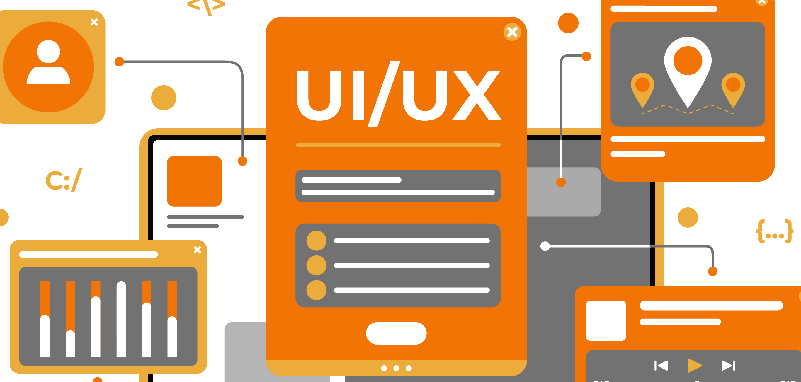
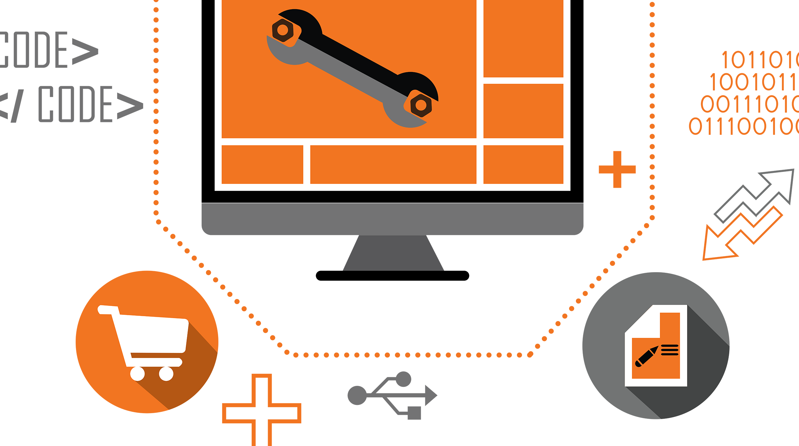
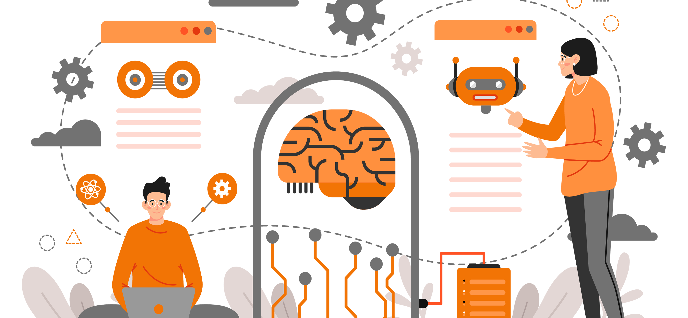
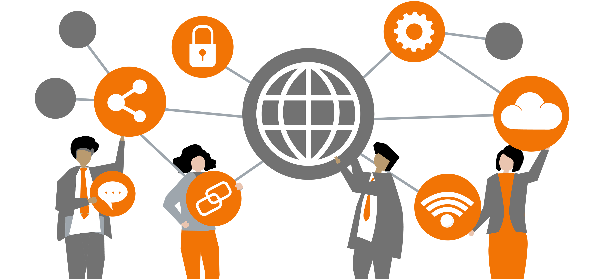

### UI/UX Design 

We focus on having a deep understanding of users, what they need, what they value, their abilities, and also their limitations in a product, system, or service.

### Application Development
 
We create programs to perform the different tasks that a business requires to automate the processes and increase efficiency by gathering requirements, designing prototypes, testing, implementation, and integration.

### Cloud Services 

Cloud services are infrastructure, platforms, or software that are hosted by third-party providers and made available to users through the internet. … Users can access cloud services with nothing more than a computer, operating system, and internet connectivity or virtual private network

### AI Integration 

The core idea of Artificial Intelligence systems integration is making individual software components,  interoperable with other components, such as common sense knowledgebases, in order to create larger, broader and more capable A.I. systems.

### Third Party Applications Integration 

Third party applications are programs written to work within operating systems, but are written by individuals or companies other than the provider of the operating system. … Any program authored by a different company or an individual is a third party application

